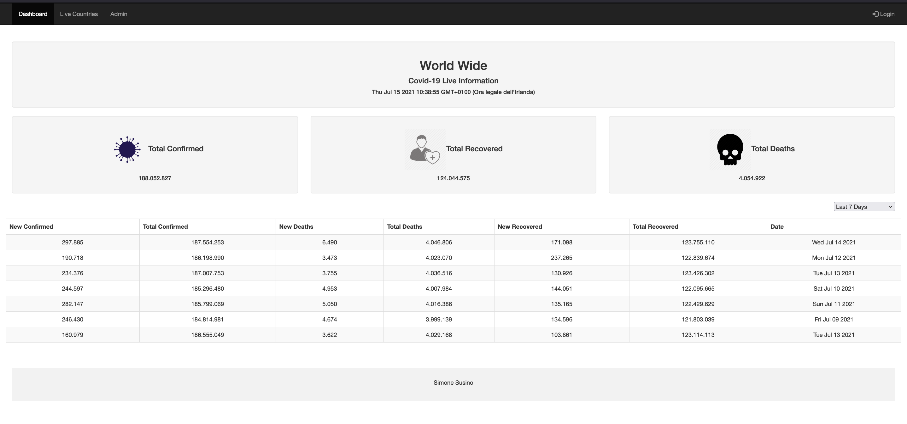

Covid-19 Dashboard  
The project is composed by 5 .php and 2 .html files that are the structure of the website, the js folder containing the boostrap and jquery scripts,
the icons folder with the icons used in the pages and the css folder.
\
The admin.sql file is outside the covid_dashboard folder and contains the script to create the database and the table with some data.
\
The API collection used is the following one:
https://documenter.getpostman.com/view/10808728/SzS8rjbc

Instructions:
1. Copy the covid_dashboard folder in your htdocs folder (if you use xampp)
2. Import the admin.sql file using phpmyadmin
3. Go to localhost/covid_dashboard from a browser to use the dashboard
4. To login, you can use two different users as admin:
    1.     Email: sim@email.com - Pass: letmein
    2.     Email: admin@email.com - Pass: letmein

Note: \
If you want to use a new database please create the database following the instrunctions below.
1. Create a new database "admin" with a table called "users"
2. Table "users" has:
   1. "id" INT AUTO INCREMENT
   2. "name" VARCHAR 255
   3. "email" VARCHAR 255
   4. "password" VARCHAR 255 (set PASSWORD in function to encrypt it) 
   5. "phone" VARCHAR 255 
   
The dashboard has been tested in Firefox 88 and Safari 14.1 

